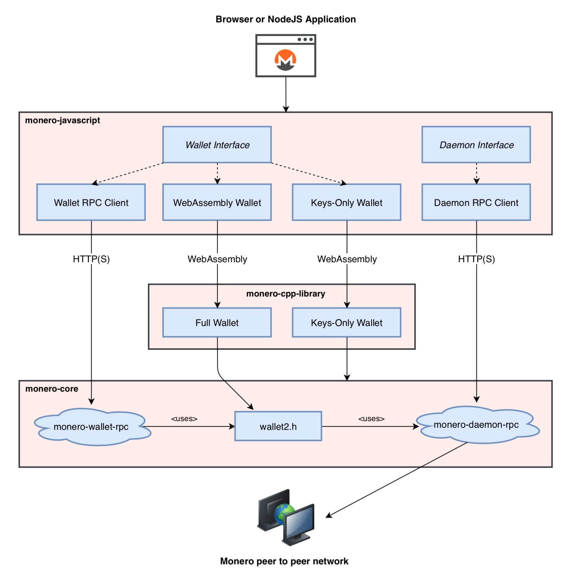

## Monero JavaScript Library

This project is a JavaScript library for using Monero with RPC and native bindings to [Monero Core v0.15.0.5 Carbon Chameleon](https://web.getmonero.org/downloads/).

- Supports RPC bindings to monero-wallet-rpc and monero-daemon-rpc.
- Supports client-side wallets in NodeJS and web apps using WebAssembly bindings to Monero Core.
- Supports offline, watch-only, and multisig wallets.
- Query wallet transactions, transfers, and outputs by their many attributes.
- Fetch and process binary data from the daemon (e.g. raw blocks).
- Receive notifications when blocks are added to the chain or when wallets sync, send, and receive.
- Conforms to an [API specification](https://moneroecosystem.org/monero-java/monero-spec.pdf) intended to be intuitive and robust.
- Over 230 passing Mocha test cases.

### Architecture

<p align="center">
	<br>
	<i>Wallet implementations use RPC or WebAssembly bindings to Monero Core and are interchangeable by conforming to a common interface, <a href="https://moneroecosystem.org/monero-javascript/MoneroWallet.html">MoneroWallet.js</a>.</i>
</p>

### Sample Code

This code introduces the API.  See the [JSDoc](https://moneroecosystem.org/monero-javascript/MoneroWallet.html) or [API specification](https://moneroecosystem.org/monero-java/monero-spec.pdf) for more information.

```js
// import library
require("monero-javascript");

// connect to a daemon
let daemon = new MoneroDaemonRpc("http://localhost:38081", "superuser", "abctesting123"); 
let height = await daemon.getHeight();            // 1523651
let feeEstimate = await daemon.getFeeEstimate();  // 1014313512
let txsInPool = await daemon.getTxPool();         // get transactions in the pool

// open wallet on monero-wallet-rpc
let walletRpc = new MoneroWalletRpc("http://localhost:38083", "rpc_user", "abc123");
await walletRpc.openWallet("sample_wallet_rpc", "supersecretpassword123");
let primaryAddress = await walletRpc.getPrimaryAddress(); // 555zgduFhmKd2o8rPUz...
let balance = await walletRpc.getBalance();               // 533648366742
let txs = await walletRpc.getTxs();                       // get transactions containing transfers to/from the wallet

// create wallet from mnemonic phrase using WebAssembly bindings to Monero Core
let walletWasm = await MoneroWalletWasm.createWallet({
  path: "sample_wallet_wasm",
  password: "supersecretpassword123",
  networkType: "stagenet",
  serverUri: "http://localhost:38081",
  serverUsername: "superuser",
  serverPassword: "abctesting123",
  mnemonic: ""hefty value scenic..."",
  restoreHeight: 573936,
});

// synchronize with progress notifications
await walletWasm.sync(new class extends MoneroWalletListener {
  onSyncProgress(height, startHeight, endHeight, percentDone, message) {
    // feed a progress bar?
  }
});

// synchronize in the background
await walletWasm.startSyncing();

// listen for incoming transfers
let fundsReceived = false;
await walletWasm.addListener(new class extends MoneroWalletListener {
  onOutputReceived(output) {
    let amount = output.getAmount();
    let txHash = output.getTx().getHash();
    fundsReceived = true;
  }
});

// send funds from RPC wallet to WebAssembly wallet
let txSet = await walletRpc.sendTx({
  accountIndex: 0,
  address: await walletWasm.getAddress(1, 0),
  amount: new BigInteger("50000"),       // amount to transfer in atomic units
  priority: MoneroTxPriority.UNIMPORTANT	// no hurry
});
let sentTx = txSet.getTxs()[0]; // send methods return tx set which contains sent tx(s)
let txHash = sentTx.getHash();

// wallet receives unconfirmed funds within 10 seconds
await new Promise(function(resolve) { setTimeout(resolve, 10000); });
assert(fundsReceived);

// save and close WebAssembly wallet
await walletWasm.close(true);
```

### Developer Guide (wip)

* [Getting Started](docs/developer_guide/getting_started.md)
* Getting started with monero-javascript web browser applications
* Connecting to Monero nodes and RPC wallet servers
* Initiating transfers
* Building client-side wallets with MoneroWalletWasm
* Managing view-only wallets
* Using multisig wallets
* Analyzing the blockchain

### How to Use This Library

1. `cd your/npm/project` or `mkdir your/npm/project && cd your/npm/project && npm init`
2. `npm install monero-javascript`
3. Add `require("monero-javascript")` to your code

### How to Run Monero RPC

1. Download and extract the latest [Monero CLI](https://getmonero.org/downloads/) for your platform.
2. Start Monero daemon locally: `./monerod --stagenet` (or use a remote daemon).
3. Create a wallet file if one does not exist.
	- Create new / open existing: `./monero-wallet-cli --daemon-address http://localhost:38081 --stagenet`
	- Restore from mnemonic seed: `./monero-wallet-cli --daemon-address http://localhost:38081 --stagenet --restore-deterministic-wallet`
4. Start monero-wallet-rpc (requires --wallet-dir to run tests):
	
	e.g. For wallet name `test_wallet_1`, user `rpc_user`, password `abc123`, stagenet: `./monero-wallet-rpc --daemon-address http://localhost:38081 --stagenet --rpc-bind-port 38083 --rpc-login rpc_user:abc123 --wallet-dir ./`

### How to Run Mocha Tests

1. Download this project and install its dependenices.  See [How to Use This Library](#how-to-use-this-library).
2. Run monero-wallet-rpc and monero-daemon-rpc.  See [How to Run Monero RPC](#how-to-run-monero-rpc). 
3. Configure the appropriate RPC endpoints and authentication by modifying `WALLET_RPC_CONFIG` and `DAEMON_RPC_CONFIG` in [TestUtils.js](src/test/TestUtils.js).
4. Run all tests: `npm test` or run tests by their description, e.g.: `node_modules/mocha/bin/mocha src/test/TestAll --grep "Can get transactions by hash" --timeout 2000000`

### How to Build WebAssembly Source

This project uses WebAssembly to package and execute Monero Core's source code for use in a browser or other WebAssembly-supported environments.

For convenience, pre-built WebAssembly files are committed to ./dist, but these files can be built independently from source code with the following steps:

1. Install and activate emscripten:
	1. Clone the emscripten project repository: `git clone https://github.com/emscripten-core/emsdk.git`
	2. `cd emsdk`
	3. `git pull && ./emsdk install latest-upstream && ./emsdk activate latest-upstream && source ./emsdk_env.sh`
	3. `export EMSCRIPTEN=/absolute/path/to/emsdk/upstream/emscripten` (change for your system)
2. `cd /path/to/monero-javascript`
3. `./bin/build_all.sh`

### See Also

* [monero-java](https://github.com/monero-ecosystem/monero-java)
* [monero-cpp-library](https://github.com/woodser/monero-cpp-library)
* [xmr-sample-app](https://github.com/woodser/xmr-sample-app/) - sample web app template (under development)
* [monerostresstester.com](https://github.com/woodser/monerostresstester.com) - sends repeated txs to self to stress test the network (under development)
* [monerowebwallet.com](https://github.com/woodser/monerowebwallet.com) - open-source, client-side web wallet (under development)

### License

This project is licensed under MIT.

### Donations

If this library brings you value, please consider donating.

<p align="center">
	<br>
	<code>46FR1GKVqFNQnDiFkH7AuzbUBrGQwz2VdaXTDD4jcjRE8YkkoTYTmZ2Vohsz9gLSqkj5EM6ai9Q7sBoX4FPPYJdGKQQXPVz</code>
</p>
