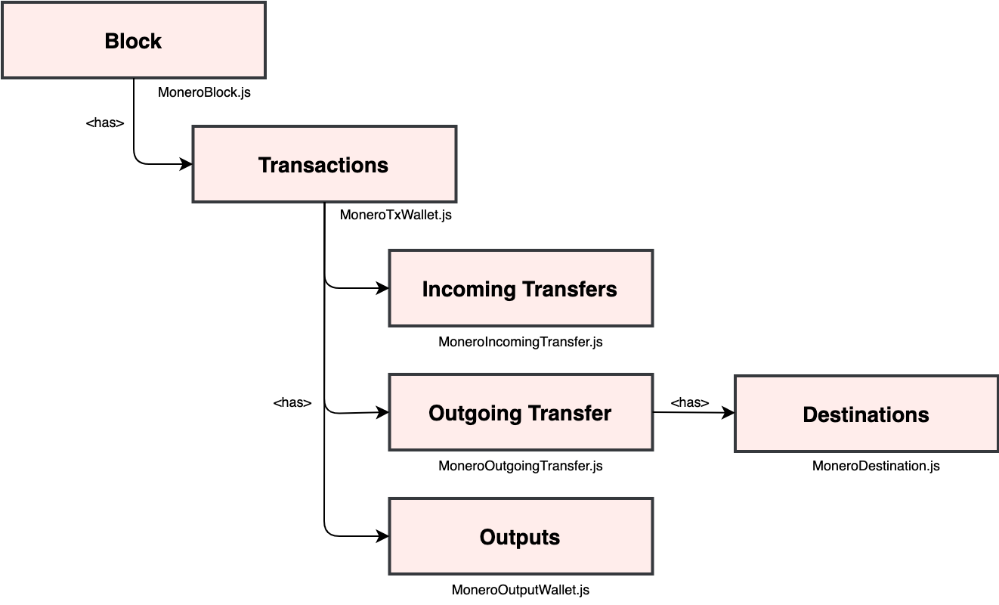

# The data model: blocks, transactions, transfers, and outputs

## Overview

This section introduces the data model used in monero-javascript.  Refer to the [API specification](https://moneroecosystem.org/monero-java/monero-spec.pdf) or [JSDocs](https://moneroecosystem.org/monero-javascript/MoneroTxWallet.html) for more information.

<p align="center">
	<br>
	<i><a href="https://moneroecosystem.org/monero-javascript/MoneroBlock.html">Blocks</a> have <a href="https://moneroecosystem.org/monero-javascript/MoneroTxWallet.html">transactions</a> which can have <a href="https://moneroecosystem.org/monero-javascript/MoneroIncomingTransfer.html">incoming transfers</a>, an <a href="https://moneroecosystem.org/monero-javascript/MoneroOutgoingTransfer.html">outgoing transfer</a>, and <a href="https://moneroecosystem.org/monero-javascript/MoneroOutputWallet.html">outputs</a>.</i>
</p>

## JSON

The following JSON demonstrates the data model as a serialized transaction which sends funds to two accounts in the same wallet, so it has both an outgoing transfer and incoming transfers.

```json
{
  "height": 582106,
  "timestamp": 1589742946,
  "txs": [
    {
      "hash": "0b30d7b7510a1aed88c87464dffdcfe9d24feffc8798e30e887e3c9c3558a814",
      "isMinerTx": false,
      "fee": 268180000,
      "relay": true,
      "isRelayed": true,
      "isConfirmed": true,
      "numConfirmations": 238,
      "unlockTime": 0,
      "isDoubleSpendSeen": false,
      "isFailed": false,
      "isLocked": false,
      "isIncoming": true,
      "isOutgoing": true,
      "outgoingAmount": 100000,
      "incomingAmount": 100000,
      "inTxPool": false,
      "incomingTransfers": [
        {
          "amount": 50000,
          "accountIndex": 1,
          "numSuggestedConfirmations": 1,
          "subaddressIndex": 0,
          "address": "73FUi8tkbeuBFSqhXzeMbd1WuMXJmdc3yeaGwx2f1NFaYzzypQ7a9scgn7JAtNagKPe4qCwE4S7wwB9ibJKv4RXnE8dtAva",
          "isIncoming": true
        },
        {
          "amount": 50000,
          "accountIndex": 2,
          "numSuggestedConfirmations": 1,
          "subaddressIndex": 0,
          "address": "7AnBDQp5ZMEWvwMxzNthWhNEvLsvTkYwp6dxnDmC88hqcLwqaD2cYmESAtqqJ9myXE6PLz5oqrApnUtqTW69mWevCZJUhWV",
          "isIncoming": true
        }
      ],
      "outgoingTransfer": {
        "amount": 100000,
        "accountIndex": 0,
        "numSuggestedConfirmations": 1,
        "subaddressIndices": [
          0
        ],
        "addresses": [
          "55bcxMRhBWea6xxsot8moF1rdPprjJR2x4mfnNnTGgBJFgXa4gWXmWAYdUBKiRcJxy9AUAGJEg28DejvWdJU2VgUDrUvCHG"
        ],
        "destinations": [
          {
            "address": "73FUi8tkbeuBFSqhXzeMbd1WuMXJmdc3yeaGwx2f1NFaYzzypQ7a9scgn7JAtNagKPe4qCwE4S7wwB9ibJKv4RXnE8dtAva",
            "amount": 50000
          },
          {
            "address": "7AnBDQp5ZMEWvwMxzNthWhNEvLsvTkYwp6dxnDmC88hqcLwqaD2cYmESAtqqJ9myXE6PLz5oqrApnUtqTW69mWevCZJUhWV",
            "amount": 50000
          }
        ],
        "isIncoming": false
      },
      "outputs": [
        {
          "keyImage": {
            "hex": "4c19ea96bc3bb9d69c477a6cdb7a76650729edfff22a2017dc5e6ea7d94c6116"
          },
          "amount": 509403744036,
          "index": 2657543,
          "accountIndex": 0,
          "subaddressIndex": 0,
          "isSpent": true,
          "isFrozen": false
        },
        {
          "keyImage": {
            "hex": "2033769e0c1e1727bca816dbd175a4b086a2fd828f33af1a023e41920963e90f"
          },
          "amount": 50000,
          "index": 2657544,
          "accountIndex": 1,
          "subaddressIndex": 0,
          "isSpent": false,
          "isFrozen": false
        },
        {
          "keyImage": {
            "hex": "6df01e19842955a13fd8908753527fe2266e2c3ce393badfd053823aab57f8e7"
          },
          "amount": 50000,
          "index": 2657542,
          "accountIndex": 2,
          "subaddressIndex": 0,
          "isSpent": false,
          "isFrozen": false
        }
      ]
    }
  ]
}
```

The top level is a block which contains transactions.

Transactions can have incoming transfers and an outgoing transfer.

The outgoing transfer may have destination addresses and amounts (note: this information is only saved locally with the wallet file and is not stored on the blockchain).

Transactions can also have outputs received by the wallet.