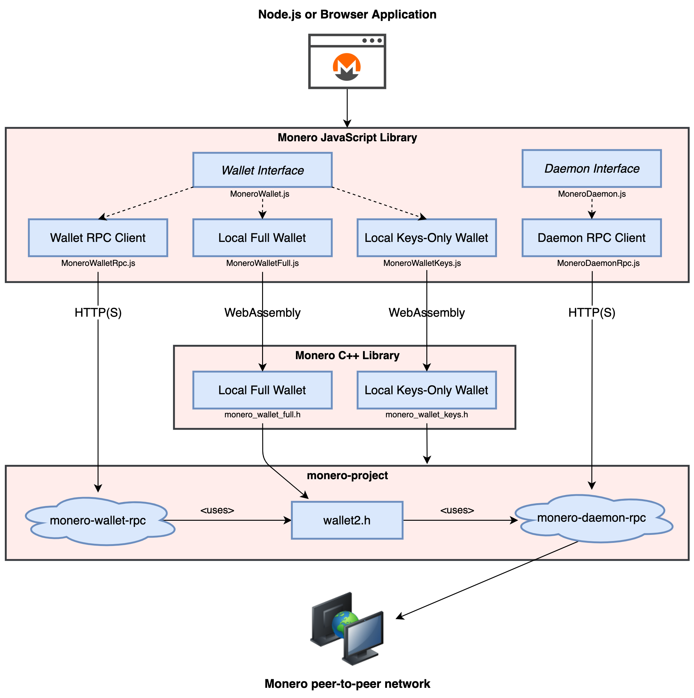

# Getting started part 1: creating a Node.js application

## What is monero-javascript?

monero-javascript is a JavaScript library for producing Monero applications. The library conforms to a [model and API specification](https://moneroecosystem.org/monero-java/monero-spec.pdf) which aims to be an intuitive and robust interface to [monero-project/monero](https://github.com/monero-project/monero).

In addition to RPC wallet and daemon server queries, monero-javascript can perform native wallet operations through WebAssembly (Wasm). The Wasm wallet enables developers to build trustless, client-side applications by eliminating the need to communicate with a RPC wallet server intermediary.

<p align="center">
	<br>
	<i>monero-javascript uses Monero through three channels: RPC wallet servers, RPC daemon servers, and Wasm wallets.</i>
</p>

## Initial Setup

### Install Node.js and the Node package manager (npm)

Node.js and npm need to be installed before using the monero-javascript library. See the ["Node.js and npm"](installing_prerequisites.md#nodejs-and-npm) section of the prerequisite installation guide for instructions to download and install Node.js and npm.

### Create a new Node.js project

1. Create project directory: `mkdir ~/git/offline_wallet_generator && cd ~/git/offline_wallet_generator`
2. Initialize the new project: `npm init -y`
3. Install the monero-javascript library: `npm install --save monero-javascript`

## Write a monero-javascript program

### The offline wallet generator

An offline wallet generator creates and displays a new, random wallet address along with that address's associated view key, spend key, and mnemonic phrase. An offline wallet generator only needs to produce and display these wallet attributes; it does not need to communicate with a Monero network, transfer XMR, or track a wallet's balance or outputs.

monero-javascript's keys-only wallet meets these requirements and is ideal for a monero-javascript-based offline wallet generator. The keys-only wallet is a minimal Wasm wallet implementation that only provides a wallet's _static_ attributes. It cannot initiate transfers, report its balance, or communicate with a Monero network.

The keys-only wallet has a file size just under 1/5 that of a standard Wasm wallet, allowing it to load more quickly.

### Write the essential monero-javascript code

Open your preferred text editor or IDE and copy the following code to a new, blank file:

```
const monerojs = require("monero-javascript");

main();
async function main() {
  // to be implemented
}
```

Note the program's two components:
1. A "require" statement to import the monero-javascript library:
`const monerojs = require("monero-javascript");`
2. An asynchronous "main" function so that calls to monero-javascript can be "awaited" (most calls are asynchronous):
`async function main() {}`

### Building a keys-only wallet

monero-javscript implements keys-only wallets in the [MoneroWalletKeys](https://moneroecosystem.org/monero-javascript/MoneroWalletKeys.html) class. You can create a random keys-only wallet as follows:
```
// create a random keys-only (offline) stagenet wallet
let monerojs = require("monero-javascript");
let keysOnlyWallet = await monerojs.createWalletKeys({networkType: "stagenet", language: "English"});
```

Wallets are created with a [MoneroWalletConfig](https://moneroecosystem.org/monero-javascript/MoneroWalletConfig) or equivalent JSON object.  The monero-javascript library will create or restore a wallet based on attributes defined in the configuration or throw an error if any attributes are invalid.  For example, a configuration that defines a view key but not a spend key will prompt the library to create a view-only wallet. The configuration object in the offline wallet generator code above contains no keys, so monero-javascript generates a new, random wallet rather than restoring an existing wallet.

The offline wallet generator displays four basic wallet attributes:
* The mnemonic phrase
* The primary address
* The spend key
* The view key

Wallet getters are used to obtain wallet attributes and log them to the console:
```
console.log("Mnemonic phrase: " + await walletKeys.getMnemonic());
console.log("Address: " + await walletKeys.getAddress(0,0)); // get address of account 0, subaddress 0
console.log("Spend key: " + await walletKeys.getPrivateSpendKey());
console.log("View key: " + await walletKeys.getPrivateViewKey());
```

The finished program should match the following:
```
const monerojs = require("monero-javascript");

main();
async function main() {
  
  // create a random keys-only (offline) stagenet wallet
  let walletKeys = await monerojs.createWalletKeys({networkType: "stagenet", language: "English"});

  // print wallet attributes
  console.log("Mnemonic phrase: " + await walletKeys.getMnemonic());
  console.log("Address: " + await walletKeys.getAddress(0,0)); // get address of account 0, subaddress 0
  console.log("Spend key: " + await walletKeys.getPrivateSpendKey());
  console.log("View key: " + await walletKeys.getPrivateViewKey());
}
```
Save the file as "offline_wallet_generator.js" and run the program with Node.js:

`node offline_wallet_generator.js`

The output should look similar to the following:
```
Mnemonic phrase: darted oatmeal toenail launching frown empty agenda apply unnoticed blip waist ashtray threaten deftly sawmill rotate skirting origin ahead obtains makeup bakery bounced dagger apply
Address: 5ATdKTGQpETCHbBHgDhwd1Wi7oo52PVZYjk2ucf5fnkn9T5yKau2UXkbm7Mo23SAx4MRdyvAaVq75LY9EjSPQnorCGebFqg
Spend key: 7bf64c44ecb5ecf02261e6d721d6201d138d0891f0fcf4d613dc27ec84bc070e
View key: b4e167b76888bf6ad4c1ab23b4d1bb2e57e7c082ac96478bcda4a9af7fd19507
```

## The next step

Continue to [Getting started part 2: creating a web application](getting_started_p2.md) to learn how to write client-side web browser applications with monero-javascript.
